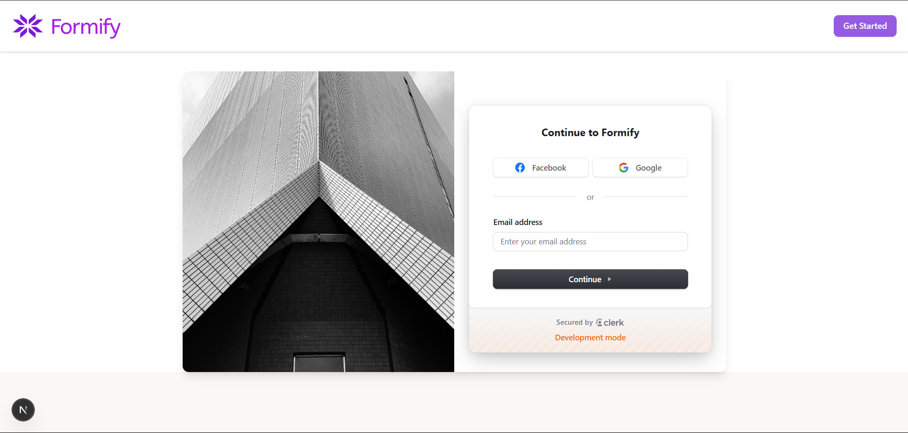
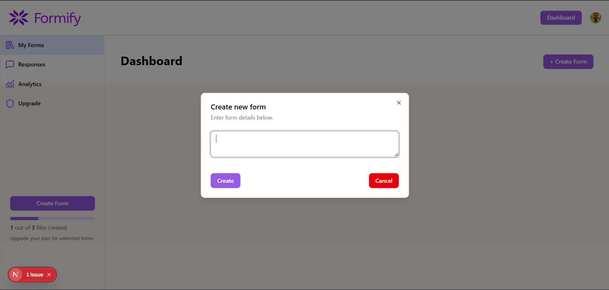
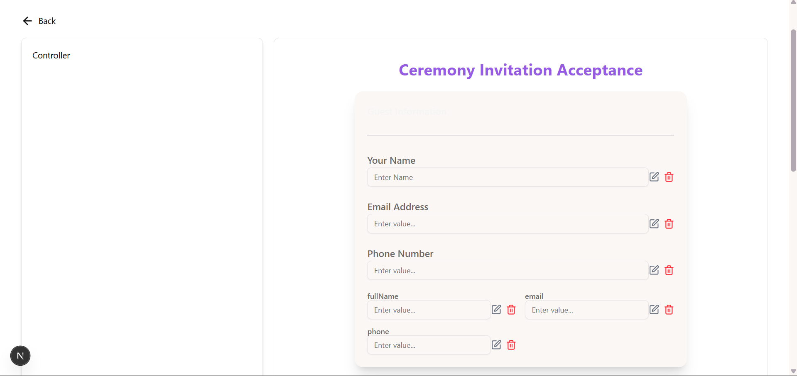

# Formify – AI-Driven Form Builder

Formify is a powerful full-stack AI-driven form builder that enables users to generate, customize, and manage dynamic forms using natural language prompts. It integrates the Gemini API for smart field generation and Clerk for secure authentication. Designed with modern aesthetics and responsiveness, Formify is perfect for teams, startups, or individuals who want quick and customizable form solutions.

## 🚀 Live Demo

Coming Soon

## 🔗 GitHub Repository

[https://github.com/tanishkgupta-18/Formify](https://github.com/tanishkgupta-18/Formify)

---

## 📌 Features

- AI-powered field generation using Gemini API  
- Seamless user authentication with Clerk  
- Fully customizable forms (themes, backgrounds)  
- Secure dashboard to manage form submissions  
- Clean and responsive UI with TailwindCSS & DaisyUI  
- Image and asset optimization via public folder support  

---

## 🛠️ Tech Stack

**Frontend**  
- Next.js  
- React.js  
- TypeScript  
- TailwindCSS  
- DaisyUI  

**Authentication**  
- Clerk  

**AI Integration**  
- Gemini API (Google Generative AI)  

---

## 📷 Screenshots






---

## ⚙️ Getting Started

### 1. Clone the Repository

```bash
git clone https://github.com/tanishkgupta-18/Formify.git
cd Formify
```

### 2. Install Dependencies
```bash
npm install
# or
yarn install

```
### 3. Create .env

```bash
NEXT_PUBLIC_CLERK_PUBLISHABLE_KEY=your_clerk_publishable_key
CLERK_SECRET_KEY=your_clerk_secret_key
GEMINI_API_KEY=your_gemini_api_key
```

### 4. Run the development server
```bash
npm run dev
# or
yarn dev
```